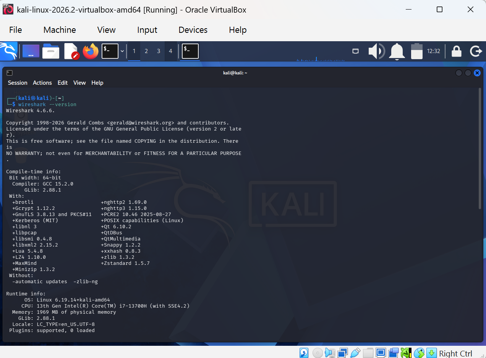
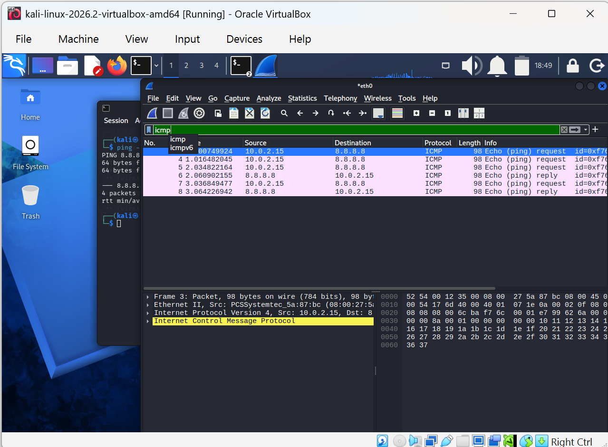

# Wireshark Network Traffic Analysis

## Project Overview

This project documents a hands-on **network traffic analysis lab using Wireshark and Kali Linux**.

The objective was to capture live network traffic, generate controlled ICMP and DNS traffic, apply Wireshark display filters, and inspect packets at the protocol level.

Through this lab, I practiced identifying network interfaces, testing connectivity, analyzing ICMP Echo Request and Echo Reply packets, examining DNS queries and responses, and correlating network requests with their corresponding responses.

This project forms part of my practical development in **cybersecurity, network security, and Security Operations Center (SOC) analysis**.

---

## Lab Environment

| Component | Configuration |
|---|---|
| Operating System | Kali Linux 2026.2 |
| Virtualization | Oracle VirtualBox |
| Packet Analyzer | Wireshark 4.6.6 |
| Network Interface | `eth0` |
| Kali IPv4 Address | `10.0.2.15/24` |
| Default Gateway | `10.0.2.2` |
| External Test Host / DNS Resolver | `8.8.8.8` |
| Protocols Analyzed | ICMP, DNS, UDP, IPv4 |

---

## Project Objectives

The objectives of this lab were to:

- Verify that Wireshark was installed and operational.
- Identify the active network interface on Kali Linux.
- Examine the host's IPv4 configuration.
- Inspect the routing table and identify the default gateway.
- Capture live network traffic using Wireshark.
- Generate controlled ICMP traffic using `ping`.
- Filter and analyze ICMP packets.
- Generate DNS traffic using `nslookup`.
- Filter and analyze DNS packets.
- Examine packet-level protocol information.
- Correlate network requests with their corresponding responses.
- Understand how packet analysis supports cybersecurity investigations.

---

# Lab Walkthrough

## 1. Verify Wireshark Installation

I first verified that Wireshark was installed on the Kali Linux system by running:

```bash
wireshark --version
```

The output confirmed that the system was running **Wireshark 4.6.6**.



Verifying the tool version is useful when documenting a lab because it establishes the environment in which the analysis was performed.

---

## 2. Identify the Network Interface

Before starting packet capture, I inspected the available network interfaces using:

```bash
ip addr
```

The active interface was identified as:

- **Interface:** `eth0`
- **IPv4 Address:** `10.0.2.15/24`


Identifying the correct network interface is important because Wireshark must capture traffic from the interface carrying the network communication being investigated.

Capturing from the wrong interface could result in missing or irrelevant traffic.

---

## 3. Start the Wireshark Packet Capture

Wireshark was launched from Kali Linux and packet capture was started on the `eth0` interface.


Once the capture was active, Wireshark began recording network packets generated by the Kali virtual machine.

This provided the packet data required for the ICMP and DNS investigations.

---

# ICMP Traffic Analysis

## 4. Generate ICMP Traffic

To generate predictable network traffic for analysis, I sent four ICMP Echo Requests to `8.8.8.8` using:

```bash
ping -c 4 8.8.8.8
```


The test transmitted four packets and received three replies during this particular test, resulting in **25% packet loss**.

The successful replies confirmed external network connectivity and generated ICMP packets that could be examined in Wireshark.

Because this was only a four-packet test, the observed packet loss should not by itself be interpreted as evidence of a persistent network problem.

---

## 5. Filter ICMP Traffic

Network captures can contain many different protocols.

To isolate the ICMP traffic, I applied the following Wireshark display filter:

```text
icmp
```



This removed unrelated packets from the current display and allowed me to focus specifically on ICMP communication.

The filtered capture showed traffic between:

```text
10.0.2.15 → 8.8.8.8
8.8.8.8 → 10.0.2.15
```


The packets included both **Echo Requests** and **Echo Replies**.

---

## 6. Analyze an ICMP Echo Request

I selected an ICMP Echo Request and expanded the **Internet Control Message Protocol** section in Wireshark.


Important fields observed included:

- **ICMP Type:** `8`
- **Message:** Echo Request
- **Code:** `0`
- **Source:** `10.0.2.15`
- **Destination:** `8.8.8.8`
- **Checksum:** Valid
- **Sequence information:** Available in the packet details

ICMP **Type 8** represents an Echo Request.

This packet was generated by the Kali machine as part of the `ping` test.

---

## 7. Analyze the ICMP Echo Reply

I then examined a corresponding Echo Reply packet.


Important fields included:

- **ICMP Type:** `0`
- **Message:** Echo Reply
- **Code:** `0`
- **Source:** `8.8.8.8`
- **Destination:** `10.0.2.15`
- **Checksum:** Valid

Wireshark correlated the reply with its corresponding request.

For the request/response pair examined, Wireshark displayed a response time of approximately:

```text
25.989 ms
```

The communication therefore followed the pattern:

```text
10.0.2.15
     |
     | ICMP Echo Request
     v
8.8.8.8
     |
     | ICMP Echo Reply
     v
10.0.2.15
```

This demonstrates how packet captures can be used to reconstruct network communication rather than relying only on command-line output.

---

# DNS Traffic Analysis

## 8. Generate DNS Traffic

The next stage focused on **Domain Name System (DNS)** traffic.

I first performed a DNS lookup using:

```bash
nslookup google.com
```


The lookup successfully returned IPv4 and IPv6 information for the domain.

This confirmed that DNS name resolution was functioning.

---

## 9. Examine the Routing Configuration

I inspected the Kali Linux routing table using:

```bash
ip route
```

The output showed a default route through:

```text
10.0.2.2
```

using:

```text
eth0
```

I then explicitly directed a DNS lookup to Google's public DNS resolver:

```bash
nslookup example.com 8.8.8.8
```


Using `8.8.8.8` directly generated controlled DNS traffic that could be captured and analyzed in Wireshark.

---

## 10. Filter DNS Traffic

To isolate DNS packets from the rest of the network capture, I applied:

```text
dns
```


The filtered capture showed DNS communication between:

```text
10.0.2.15 → 8.8.8.8
8.8.8.8 → 10.0.2.15
```

The packet list included both:

- **A queries**
- **AAAA queries**

An **A record** is used to obtain an IPv4 address.

An **AAAA record** is used to obtain an IPv6 address.

---

## 11. Analyze the DNS Query

I selected one of the DNS requests and expanded the **Domain Name System (query)** section.


The packet contained information including:

- Transaction ID
- DNS flags
- Number of questions
- Number of answers
- Requested domain
- Query type
- Query class

The selected request used the transaction ID:

```text
0x3c4d
```

Wireshark also identified the frame containing the corresponding response.

Transaction IDs are important because they allow DNS requests to be associated with their responses.

---

## 12. Inspect the Requested Domain

I expanded the **Queries** section of the DNS request.


The query requested:

```text
example.net
```

with:

```text
Type: A
Class: IN
```

### Type A

An **A record** maps a domain name to an IPv4 address.

### Class IN

`IN` represents the Internet class used for normal Internet DNS records.

This demonstrates that conventional unencrypted DNS traffic can expose information about the domains a system is attempting to resolve.

For a security analyst, DNS activity can therefore provide useful evidence when investigating endpoint behavior.

---

## 13. Analyze the DNS Response

I then examined the corresponding DNS response.


The response:

- Originated from `8.8.8.8`
- Was sent to `10.0.2.15`
- Used transaction ID `0x3c4d`
- Matched the original DNS request
- Reported no DNS error
- Contained two answer resource records
- Returned IPv4 addresses for `example.net`

Wireshark also displayed a DNS transaction time of approximately:

```text
120.36 ms
```

The communication followed the general pattern:

```text
Kali Linux
10.0.2.15
     |
     | DNS Query: example.net
     | Type A
     v
Google DNS
8.8.8.8
     |
     | DNS Response
     | IPv4 Address Records
     v
Kali Linux
10.0.2.15
```

Matching the transaction ID and Wireshark's request/response references confirmed that the packets belonged to the same DNS exchange.

---

# Key Findings

The analysis demonstrated that:

- Wireshark successfully captured live network traffic from `eth0`.
- The Kali Linux host used IPv4 address `10.0.2.15/24`.
- The default route used gateway `10.0.2.2`.
- ICMP packets could be isolated using the `icmp` display filter.
- ICMP Type `8` represents an Echo Request.
- ICMP Type `0` represents an Echo Reply.
- Wireshark can correlate ICMP requests with their replies.
- Response timing can be examined at packet level.
- DNS traffic could be isolated using the `dns` display filter.
- DNS A records are used for IPv4 resolution.
- DNS AAAA records are used for IPv6 resolution.
- DNS transaction IDs help correlate requests and responses.
- Conventional unencrypted DNS traffic can expose queried domain names and returned IP addresses.

---

# Cybersecurity Relevance

Packet analysis is an important skill in cybersecurity because network communication can provide evidence about the behavior of systems, applications, users, and potentially malicious processes.

Wireshark can support activities such as:

- Network troubleshooting
- Security monitoring
- Investigating suspicious network connections
- Identifying unusual DNS activity
- Investigating potential malware communication
- Detecting certain reconnaissance patterns
- Examining potential command-and-control communication
- Validating network behavior
- Supporting incident-response investigations
- Understanding communication between endpoints

DNS analysis is particularly useful because suspicious software often needs to resolve domain names before communicating with external infrastructure.

ICMP analysis can also assist with connectivity troubleshooting and the investigation of certain network reconnaissance patterns.

Understanding normal protocol behavior provides an important foundation for identifying abnormal behavior.

---

# Challenges and Troubleshooting

The lab also involved troubleshooting.

At one stage, Kali Linux temporarily became unresponsive while Wireshark and terminal activity were running inside the virtual machine.

After the environment recovered, the investigation continued without restarting the entire project.

Another challenge occurred when the `dns` display filter initially returned no visible packets.

Troubleshooting included:

- Confirming the active network interface
- Inspecting the routing table
- Confirming that Wireshark was capturing on `eth0`
- Generating fresh DNS traffic
- Explicitly directing DNS requests to `8.8.8.8`
- Reapplying the DNS display filter

This reinforced an important packet-analysis principle:

> A valid display filter cannot display packets that were not captured.

The troubleshooting process was therefore an important part of the learning experience rather than simply an obstacle.

---

# Commands and Filters Used

| Command / Filter | Purpose |
|---|---|
| `wireshark --version` | Verify Wireshark installation and version |
| `ip addr` | Display network interfaces and IP addresses |
| `ip route` | Examine the routing table and default gateway |
| `ping -c 4 8.8.8.8` | Test connectivity and generate ICMP traffic |
| `nslookup google.com` | Test DNS name resolution |
| `nslookup example.com 8.8.8.8` | Query a specific DNS resolver |
| `icmp` | Wireshark display filter for ICMP |
| `dns` | Wireshark display filter for DNS |
| `udp.port == 53 || tcp.port == 53` | Filter conventional DNS traffic by port |

---

# Skills Demonstrated

This project provided hands-on practice with:

- Kali Linux
- Wireshark
- Network traffic analysis
- Packet capture
- Network interface identification
- IPv4 addressing
- Routing
- ICMP analysis
- DNS analysis
- UDP fundamentals
- Wireshark display filters
- Packet inspection
- Protocol analysis
- Request/response correlation
- DNS transaction analysis
- Network troubleshooting
- Technical documentation
- Evidence collection

---

# Limitations

This project was performed in a **controlled VirtualBox lab environment**.

The network topology and addressing therefore represent a virtualized lab rather than a production enterprise network.

The 25% packet loss observed during the ICMP test was based on only four transmitted packets and should not be interpreted as evidence of a persistent network problem.

The DNS observations also relate to the conventional DNS traffic captured during this exercise.

Encrypted DNS technologies such as **DNS over HTTPS (DoH)** and **DNS over TLS (DoT)** can reduce the visibility of DNS query contents in a basic packet capture.

---

# What I Learned

This lab helped me move beyond simply using networking commands and begin examining what those commands actually generate on a network.

For example, instead of only seeing that `ping` received a reply, I was able to inspect the underlying ICMP Echo Request and Echo Reply packets.

Similarly, rather than only seeing the result of `nslookup`, I was able to examine the DNS query, identify the requested record type, correlate the transaction ID with the response, and inspect the returned address records.

This strengthened my understanding of the relationship between:

```text
Command-line activity
        ↓
Network protocols
        ↓
Packets
        ↓
Packet capture
        ↓
Analysis
```

---

# Conclusion

This project provided practical experience capturing, filtering, and analyzing network traffic using **Wireshark and Kali Linux**.

By generating ICMP and DNS traffic and examining the resulting packets, I developed a stronger understanding of how common network protocols operate at packet level.

The project also introduced a structured investigation workflow:

1. Identify the network environment.
2. Generate or observe network activity.
3. Capture the traffic.
4. Apply appropriate filters.
5. Inspect relevant packets.
6. Correlate requests and responses.
7. Interpret the findings.
8. Document the evidence.

These skills provide a foundation for continued development in **cybersecurity, network security, incident investigation, and SOC analysis**.

---

# Future Improvements

Future extensions of this project may include:

- TCP three-way handshake analysis
- TCP flag analysis
- HTTP traffic analysis
- TLS traffic inspection
- ARP traffic analysis
- Nmap scan traffic analysis
- Port-scan detection
- Suspicious DNS investigation
- PCAP-based incident investigation
- Malicious traffic analysis
- Network Indicators of Compromise (IOCs)
- Comparing normal and suspicious network behavior

---

## Project Status

**Completed — July 2026**

This project is part of my ongoing hands-on cybersecurity learning journey.
