# Wireshark Network Traffic Analysis

## Project Overview

This project documents a hands-on **network traffic analysis lab using Wireshark and Kali Linux**.

The objective was to capture live network traffic, generate controlled ICMP and DNS traffic, apply Wireshark display filters, and inspect packets at the protocol level.

Through this lab, I practised identifying network interfaces, testing connectivity, analysing ICMP Echo Request and Echo Reply packets, examining DNS queries and responses, and correlating network requests with their corresponding responses.

This project forms part of my practical development in **cybersecurity, network security, and Security Operations Centre (SOC) analysis**.

---

## Lab Environment

| Component | Configuration |
|---|---|
| Operating System | Kali Linux 2026.2 |
| Virtualisation | Oracle VirtualBox |
| Packet Analyser | Wireshark 4.6.6 |
| Network Interface | `eth0` |
| Kali IPv4 Address | `10.0.2.15/24` |
| Default Gateway | `10.0.2.2` |
| External Test Host / DNS Resolver | `8.8.8.8` |
| Protocols Analysed | ICMP, DNS, UDP, IPv4 |

---

## Project Objectives

The objectives of this lab were to:

- Verify that Wireshark was installed and operational.
- Identify the active network interface on Kali Linux.
- Examine the host's IPv4 configuration.
- Inspect the routing table and identify the default gateway.
- Capture live network traffic using Wireshark.
- Generate controlled ICMP traffic using `ping`.
- Filter and analyse ICMP packets.
- Generate DNS traffic using `nslookup`.
- Filter and analyse DNS packets.
- Examine packet-level protocol information.
- Correlate network requests with their corresponding responses.
- Understand how packet analysis supports cybersecurity investigations.

---

# Lab Walkthrough

## 1. Verify Wireshark Installation

I first verified that Wireshark was installed on the Kali Linux system by running:

```bash
wireshark --version
```

The output confirmed that the system was running **Wireshark 4.6.6**.


Verifying the tool version is useful when documenting a lab because it establishes the environment in which the analysis was performed.

---

## 2. Identify the Network Interface

Before starting packet capture, I inspected the available network interfaces using:

```bash
ip addr
```

The active interface was identified as:

- **Interface:** `eth0`
- **IPv4 Address:** `10.0.2.15/24`

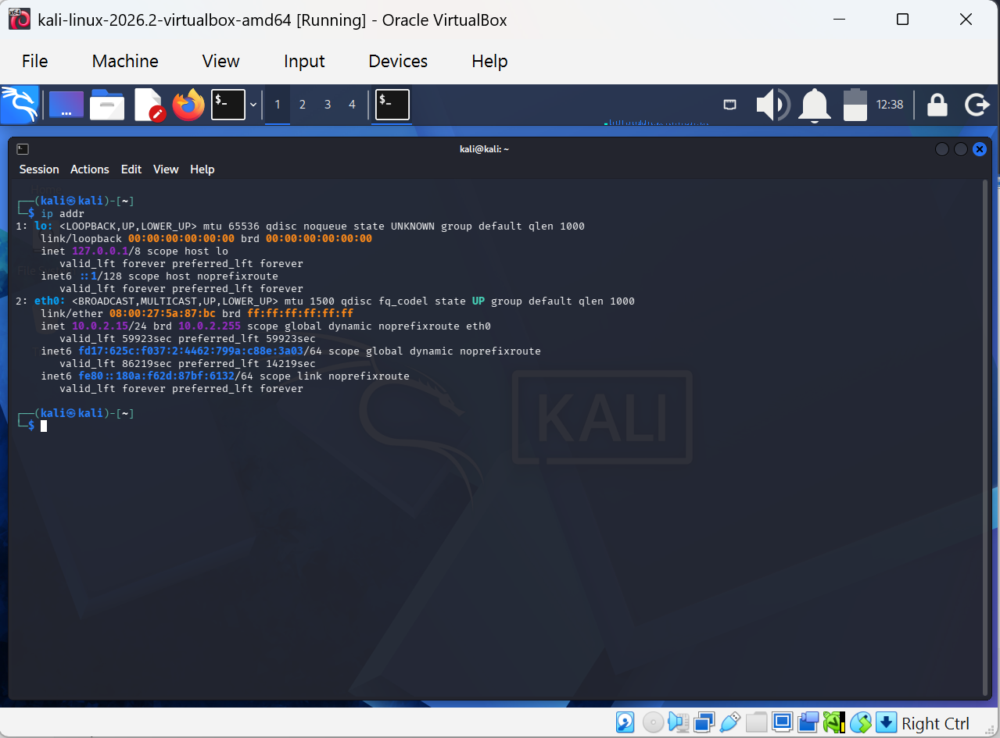

Identifying the correct network interface is important because Wireshark must capture traffic from the interface carrying the network communication being investigated.

Capturing from the wrong interface could result in missing or irrelevant traffic.

---

## 3. Start the Wireshark Packet Capture

Wireshark was launched from Kali Linux and packet capture was started on the `eth0` interface.

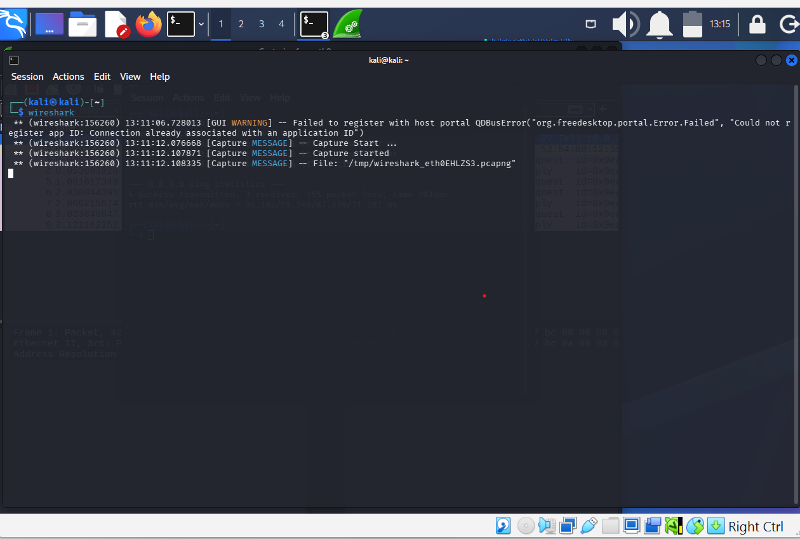

Once the capture was active, Wireshark began recording network packets generated by the Kali virtual machine.

This provided the packet data required for the ICMP and DNS investigations.

---

# ICMP Traffic Analysis

## 4. Generate ICMP Traffic

To generate predictable network traffic for analysis, I sent four ICMP Echo Requests to Google's public DNS server at `8.8.8.8` using:

```bash
ping -c 4 8.8.8.8
```

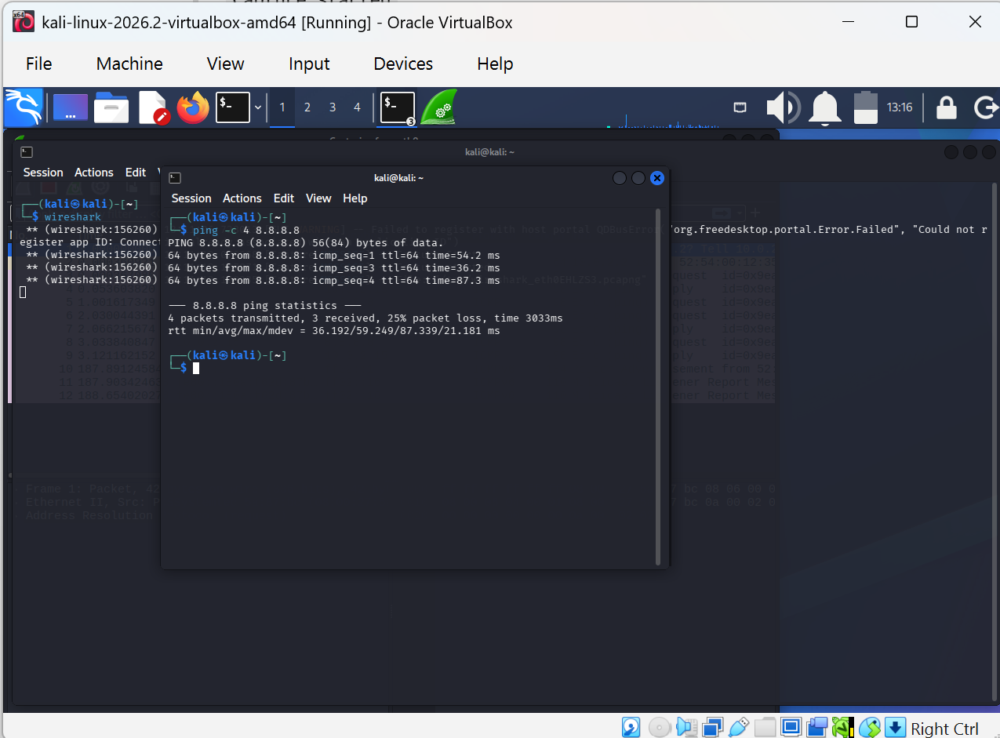

The test transmitted four packets and received three replies during this particular test, resulting in **25% packet loss**.

The successful replies confirmed external network connectivity and generated ICMP packets that could be examined in Wireshark.

Because this was only a four-packet test, the observed packet loss should not by itself be interpreted as evidence of a persistent network problem.

---

## 5. Filter ICMP Traffic

Network captures can contain many different protocols. To isolate the ICMP traffic, I applied the following Wireshark display filter:

```text
icmp
```


This removed unrelated packets from the current display and allowed me to focus specifically on ICMP communication.

The filtered capture showed communication between:

```text
10.0.2.15 → 8.8.8.8
8.8.8.8 → 10.0.2.15
```

The packets included both **ICMP Echo Requests** and **ICMP Echo Replies**.

---

## 6. Analyse an ICMP Echo Request

I selected an ICMP Echo Request and expanded the **Internet Control Message Protocol** section in Wireshark.

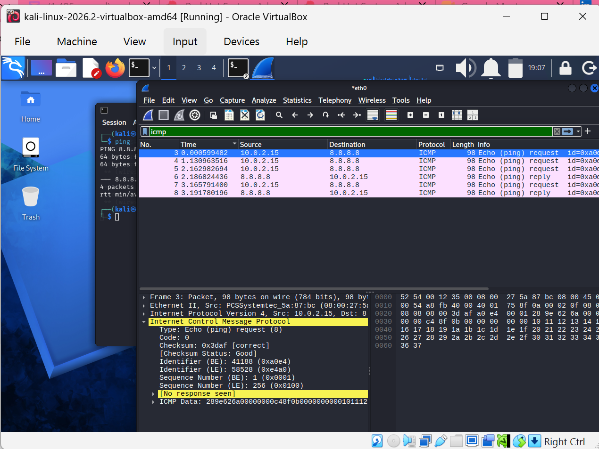

Important fields observed included:

- **ICMP Type:** `8`
- **Message:** Echo Request
- **Code:** `0`
- **Source:** `10.0.2.15`
- **Destination:** `8.8.8.8`
- **Checksum:** Valid
- **Sequence information:** Available in the packet details

ICMP **Type 8** represents an Echo Request.

The source and destination addresses show that the Kali Linux machine at `10.0.2.15` initiated the request to `8.8.8.8`.

This packet was generated as part of the `ping` connectivity test.

---

## 7. Analyse the ICMP Echo Reply

I then examined the corresponding ICMP Echo Reply.


Important fields included:

- **ICMP Type:** `0`
- **Message:** Echo Reply
- **Code:** `0`
- **Source:** `8.8.8.8`
- **Destination:** `10.0.2.15`
- **Checksum:** Valid

ICMP **Type 0** represents an Echo Reply.

The source and destination addresses are reversed compared with the Echo Request because `8.8.8.8` is responding to the Kali Linux host.

Wireshark correlated the reply with its corresponding request.

For the request/response pair examined, Wireshark displayed a response time of approximately:

```text
25.989 ms
```

The communication therefore followed this pattern:

```text
10.0.2.15
     |
     | ICMP Echo Request (Type 8)
     v
8.8.8.8
     |
     | ICMP Echo Reply (Type 0)
     v
10.0.2.15
```

This demonstrates how packet captures can be used to reconstruct network communication rather than relying only on command-line output.

---

# DNS Traffic Analysis

## 8. Generate DNS Traffic

The next stage of the investigation focused on **Domain Name System (DNS)** traffic.

I first performed a DNS lookup using:

```bash
nslookup google.com
```

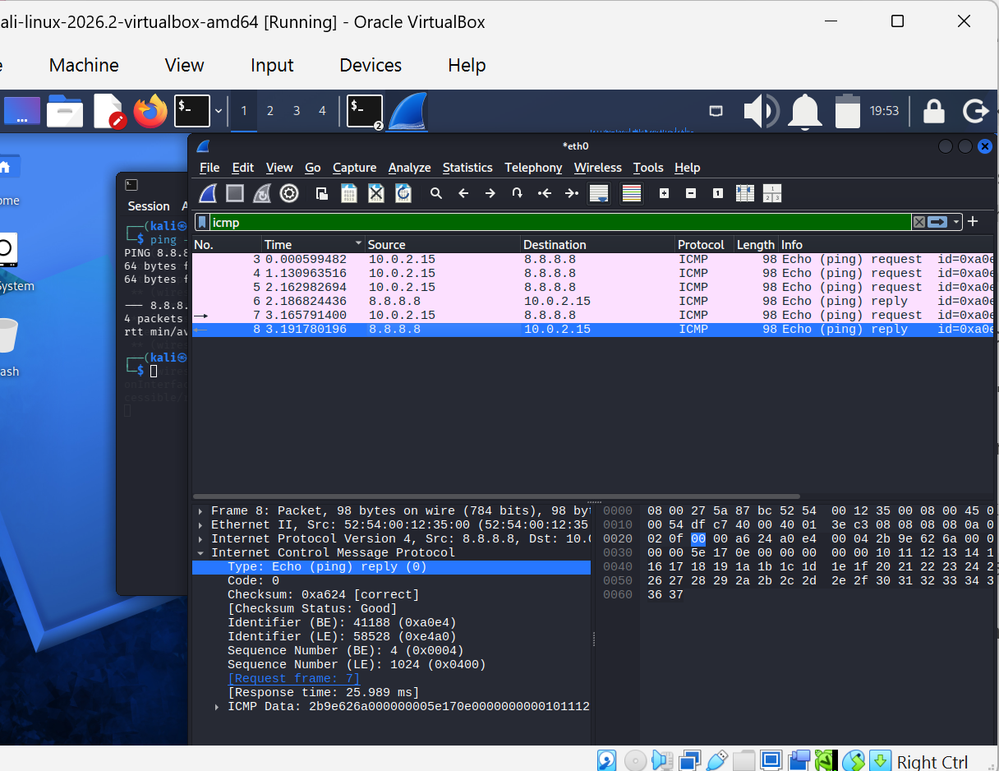

The lookup successfully returned address information for the domain.

This confirmed that DNS name resolution was functioning on the Kali Linux virtual machine.

---

## 9. Examine Routing and Generate Controlled DNS Traffic

Before analysing the DNS packets, I inspected the Kali Linux routing table using:

```bash
ip route
```

The output showed a default route through:

```text
10.0.2.2
```

using the network interface:

```text
eth0
```

I then explicitly directed a DNS lookup to Google's public DNS resolver using:

```bash
nslookup example.com 8.8.8.8
```

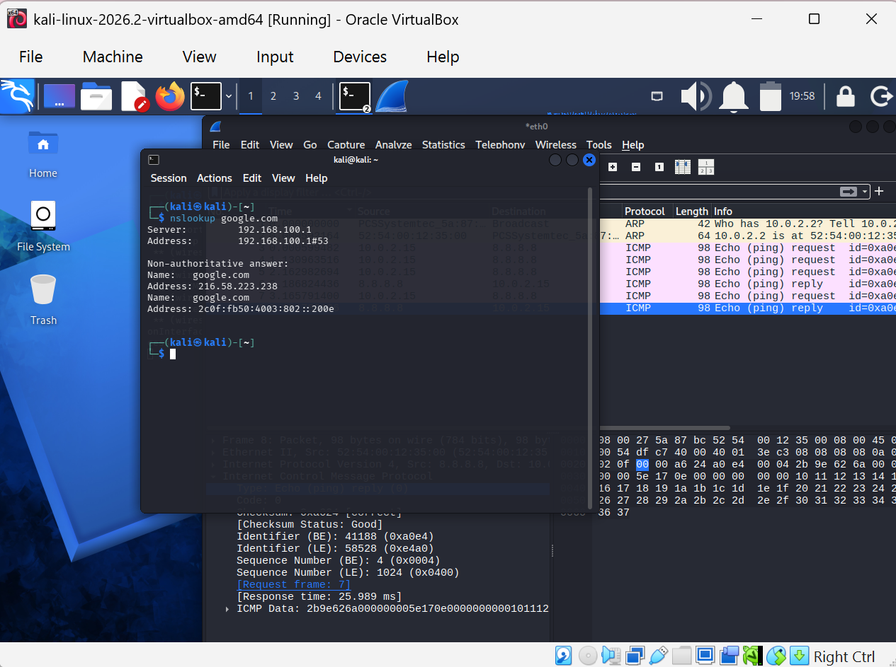

This test served two purposes.

First, examining the routing table confirmed how the Kali virtual machine reached external networks.

Second, explicitly specifying `8.8.8.8` as the DNS resolver generated predictable DNS communication that could be captured and examined in Wireshark.

---

## 10. Filter DNS Traffic

To isolate DNS packets from the rest of the network capture, I applied the following Wireshark display filter:

```text
dns
```

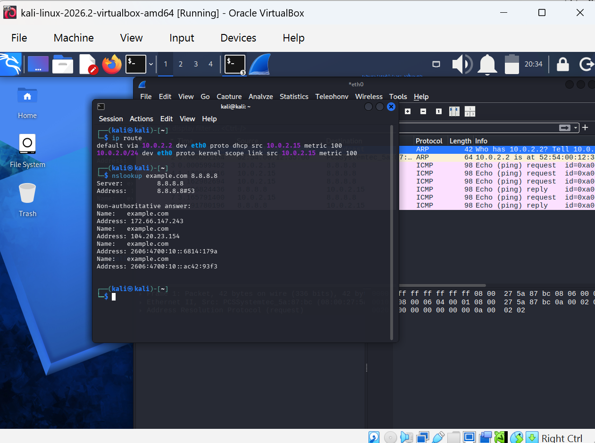

The filtered capture showed DNS communication between:

```text
10.0.2.15 → 8.8.8.8
8.8.8.8 → 10.0.2.15
```

The packet list included both:

- **A queries**
- **AAAA queries**

An **A record** is used to map a domain name to an IPv4 address.

An **AAAA record** is used to map a domain name to an IPv6 address.

Applying the display filter made it easier to focus on the DNS request-and-response traffic without unrelated packets cluttering the packet list.

---

## 11. Analyse the DNS Query

I selected one of the DNS request packets and expanded the **Domain Name System (query)** section.

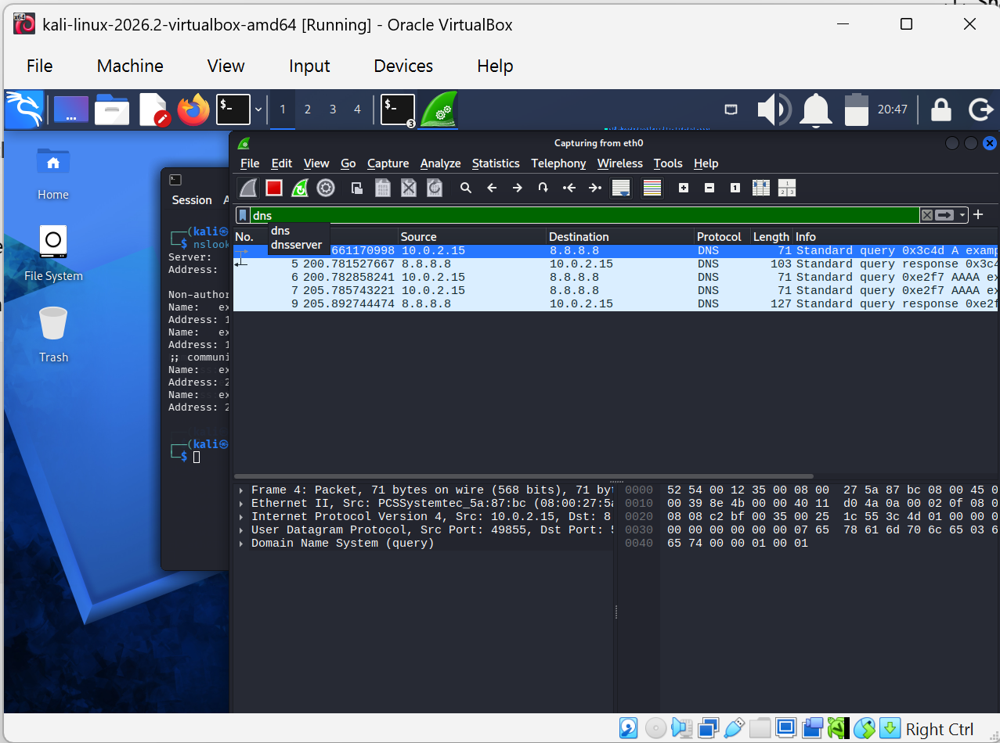

The packet contained information including:

- Transaction ID
- DNS flags
- Number of questions
- Number of answers
- Requested domain
- Query type
- Query class
- Reference to the corresponding response

For the selected DNS request, the transaction ID was:

```text
0x3c4d
```

The packet was sent from:

```text
10.0.2.15 → 8.8.8.8
```

This shows that the Kali Linux host generated the DNS request and sent it to the specified resolver.

DNS transaction IDs are important because they allow requests to be associated with their corresponding responses.

---

## 12. Inspect the Requested Domain

I expanded the **Queries** section of the DNS request to inspect the requested domain and record type.

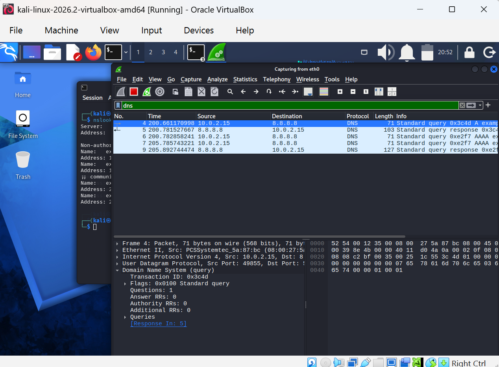

The query requested:

```text
example.net
```

with:

```text
Type: A
Class: IN
```

### Type A

An **A record** maps a domain name to an IPv4 address.

The client was therefore requesting the IPv4 address associated with `example.net`.

### Class IN

`IN` represents the **Internet** class used for standard Internet DNS records.

The packet therefore represents a conventional DNS request asking:

> What IPv4 address is associated with `example.net`?

This demonstrates that conventional unencrypted DNS traffic can expose information about the domains a system is attempting to resolve.

For a security analyst, DNS activity can provide useful evidence when investigating endpoint behaviour.

---

## 13. Analyse the DNS Response

I then selected the corresponding DNS response packet.

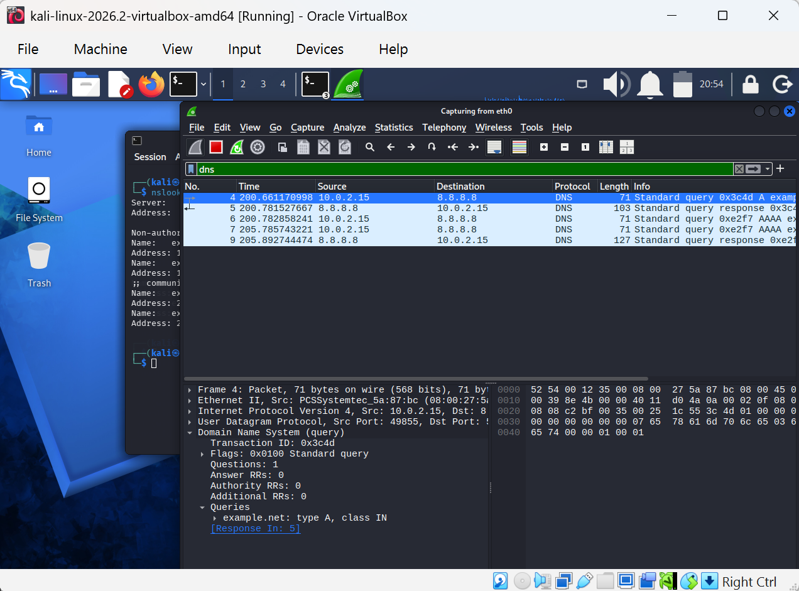

The response:

- Originated from `8.8.8.8`
- Was sent to `10.0.2.15`
- Used transaction ID `0x3c4d`
- Matched the original DNS request
- Reported no DNS error
- Contained answer resource records
- Returned IPv4 addresses for the requested domain

The source and destination addresses are reversed compared with the query because the DNS resolver is responding to the Kali Linux client.

---

## 14. Inspect the DNS Response Details

I expanded the **Domain Name System (response)** section to examine the returned records and the relationship between the request and response.

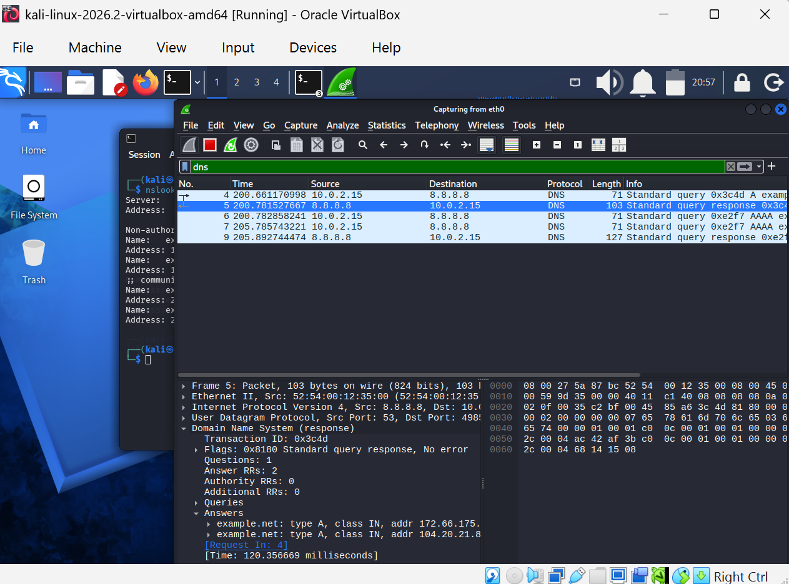

The response used the same transaction ID as the original query:

```text
0x3c4d
```

Wireshark reported:

```text
Standard query response, No error
```

The response contained:

```text
Questions: 1
Answer RRs: 2
Authority RRs: 0
Additional RRs: 0
```

The answer section contained IPv4 address records for the requested domain.

Wireshark also linked the response to its corresponding request and displayed a DNS transaction time of approximately:

```text
120.36 ms
```

The DNS communication followed the general pattern:

```text
Kali Linux
10.0.2.15
     |
     | DNS Query
     | example.net
     | Type A
     v
Google Public DNS
8.8.8.8
     |
     | DNS Response
     | IPv4 Address Records
     v
Kali Linux
10.0.2.15
```

Matching the transaction ID and Wireshark's request/response references confirmed that the packets belonged to the same DNS exchange.

---

# Key Findings

The analysis demonstrated that:

- Wireshark successfully captured live network traffic from the `eth0` interface.
- The Kali Linux host used IPv4 address `10.0.2.15/24`.
- The default route used gateway `10.0.2.2`.
- ICMP packets could be isolated using the `icmp` display filter.
- ICMP Type `8` represents an Echo Request.
- ICMP Type `0` represents an Echo Reply.
- ICMP requests and replies can be correlated in Wireshark.
- Response timing can be examined at packet level.
- DNS traffic could be isolated using the `dns` display filter.
- DNS A records are used for IPv4 address resolution.
- DNS AAAA records are used for IPv6 address resolution.
- DNS transaction IDs help correlate requests and responses.
- DNS queries reveal the record type being requested.
- DNS responses contain the address information returned by the resolver.
- Conventional unencrypted DNS traffic can expose queried domain names and returned IP addresses.
- Packet analysis provides greater visibility into network communication than command-line results alone.

---

# Cybersecurity Relevance

Packet analysis is an important cybersecurity skill because network traffic can provide evidence about the behaviour of systems, applications, users, and potentially malicious processes.

Wireshark can support activities such as:

- Network troubleshooting
- Security monitoring
- Investigating suspicious network connections
- Identifying unusual DNS activity
- Investigating potential malware communication
- Detecting certain reconnaissance patterns
- Examining potential command-and-control communication
- Validating firewall and network behaviour
- Supporting incident-response investigations
- Understanding communication between endpoints
- Investigating unexpected outbound connections
- Identifying protocol anomalies

DNS analysis is particularly useful because malicious software may need to resolve domain names before communicating with external infrastructure.

Analysts can therefore examine DNS activity for unusual domains, unexpected DNS servers, abnormal query patterns, or other indicators that may require further investigation.

ICMP analysis can assist with connectivity troubleshooting and the investigation of certain reconnaissance behaviours.

Understanding normal protocol behaviour provides an important foundation for recognising abnormal network activity.

---

# Challenges and Troubleshooting

The lab also involved practical troubleshooting.

At one stage, Kali Linux temporarily became unresponsive while Wireshark and terminal activity were running inside the virtual machine.

After the environment recovered, the investigation continued without restarting the entire project.

Another challenge occurred when the `dns` display filter initially returned no visible packets.

Troubleshooting included:

- Confirming the active network interface.
- Inspecting the routing table.
- Confirming that Wireshark was capturing on `eth0`.
- Generating fresh DNS traffic.
- Explicitly directing DNS requests to `8.8.8.8`.
- Reapplying the DNS display filter.
- Examining the newly generated packets.

This reinforced an important packet-analysis principle:

> A valid display filter cannot display packets that were not captured.

The troubleshooting process was therefore an important part of the learning experience rather than simply an obstacle.

It demonstrated the importance of validating the capture environment before assuming that a display filter or analysis tool is malfunctioning.

---

# Commands and Filters Used

| Command / Filter | Purpose |
|---|---|
| `wireshark --version` | Verify Wireshark installation and version |
| `ip addr` | Display network interfaces and IP addresses |
| `ip route` | Examine the routing table and default gateway |
| `ping -c 4 8.8.8.8` | Test connectivity and generate ICMP traffic |
| `nslookup google.com` | Test DNS name resolution |
| `nslookup example.com 8.8.8.8` | Query a specific DNS resolver |
| `icmp` | Wireshark display filter for ICMP |
| `dns` | Wireshark display filter for DNS |
| `udp.port == 53 || tcp.port == 53` | Filter conventional DNS traffic by port |

---

# Protocol Summary

## ICMP

The **Internet Control Message Protocol (ICMP)** is primarily used for network diagnostics and error reporting.

In this project, ICMP was generated using the `ping` command.

The two primary ICMP message types examined were:

| ICMP Type | Meaning |
|---|---|
| `8` | Echo Request |
| `0` | Echo Reply |

The Echo Request was transmitted from the Kali Linux host to `8.8.8.8`, while the Echo Reply travelled in the opposite direction.

---

## DNS

The **Domain Name System (DNS)** translates human-readable domain names into IP addresses that computers can use for network communication.

The project examined two DNS record types:

| Record Type | Purpose |
|---|---|
| `A` | Maps a domain name to an IPv4 address |
| `AAAA` | Maps a domain name to an IPv6 address |

DNS requests and responses can be correlated using their transaction IDs.

This makes it possible to reconstruct individual DNS exchanges within a packet capture.

---

# Skills Demonstrated

This project provided hands-on practice with:

- Kali Linux
- Wireshark
- Network traffic analysis
- Packet capture
- Network interface identification
- IPv4 addressing
- Network routing
- ICMP analysis
- DNS analysis
- UDP fundamentals
- Wireshark display filters
- Packet inspection
- Protocol analysis
- Request/response correlation
- DNS transaction analysis
- Network troubleshooting
- Technical documentation
- Evidence collection
- Basic network-security analysis

---

# Limitations

This project was performed in a **controlled Oracle VirtualBox lab environment**.

The network topology and addressing therefore represent a virtualised lab rather than a production enterprise network.

The 25% packet loss observed during the ICMP test was based on only four transmitted packets and should not be interpreted as evidence of a persistent network problem.

The DNS observations relate specifically to conventional DNS traffic captured during this exercise.

Encrypted DNS technologies such as **DNS over HTTPS (DoH)** and **DNS over TLS (DoT)** can reduce the visibility of DNS query contents in a basic packet capture.

The project also focused on normal ICMP and DNS traffic rather than malicious traffic.

Future projects can build on this foundation by comparing legitimate network behaviour with suspicious or malicious traffic.

---

# What I Learned

This lab helped me move beyond simply using networking commands and begin examining what those commands actually generate on a network.

For example, instead of only seeing that `ping` received a reply, I was able to inspect the underlying ICMP Echo Request and Echo Reply packets.

I could identify:

- The source and destination IP addresses.
- ICMP message types.
- Sequence information.
- Checksums.
- Request/response relationships.
- Response timing.

Similarly, rather than only seeing the result of `nslookup`, I was able to examine the DNS query itself.

I could identify:

- The DNS resolver.
- The requested domain.
- The requested record type.
- The transaction ID.
- The corresponding response.
- The returned address records.
- The DNS transaction time.

This strengthened my understanding of the relationship between:

```text
Command-line activity
        ↓
Network protocols
        ↓
Packets
        ↓
Packet capture
        ↓
Protocol analysis
        ↓
Security investigation
```

The project also reinforced that effective packet analysis requires more than applying filters. An analyst must understand what traffic should exist, where it should appear, how protocols behave, and how related packets can be correlated.

---

# Investigation Workflow

The project followed a basic packet-analysis workflow that can be applied to future networking and cybersecurity investigations:

```text
1. Understand the network environment
              ↓
2. Identify the correct interface
              ↓
3. Generate or observe network activity
              ↓
4. Capture the traffic
              ↓
5. Apply appropriate display filters
              ↓
6. Identify relevant packets
              ↓
7. Inspect protocol fields
              ↓
8. Correlate requests and responses
              ↓
9. Interpret the findings
              ↓
10. Document the evidence
```

Following a structured process helps prevent conclusions from being based on isolated packets without sufficient context.

---

# Conclusion

This project provided practical experience capturing, filtering, and analysing network traffic using **Wireshark and Kali Linux**.

By generating ICMP and DNS traffic and examining the resulting packets, I developed a stronger understanding of how common network protocols operate at packet level.

Rather than relying only on the output of commands such as `ping` and `nslookup`, Wireshark allowed me to inspect the actual network communication generated by those commands.

The ICMP investigation demonstrated how Echo Requests and Echo Replies can be identified and correlated.

The DNS investigation demonstrated how domain-name queries and responses can be captured, filtered, inspected, and associated using transaction IDs.

The troubleshooting performed during the lab also reinforced the importance of validating the capture interface, generating appropriate traffic, and understanding the distinction between packet capture and display filtering.

Overall, the project strengthened my foundation in **network traffic analysis, protocol analysis, cybersecurity investigation, and SOC-related skills**.

---

# Future Improvements

Future extensions of this project may include:

- TCP three-way handshake analysis
- TCP flag analysis
- HTTP traffic analysis
- TLS traffic inspection
- ARP traffic analysis
- Nmap scan traffic analysis
- Port-scan detection
- Suspicious DNS investigation
- PCAP-based incident investigation
- Malicious traffic analysis
- Network Indicators of Compromise (IOCs)
- Comparing normal and suspicious network behaviour
- Investigating failed connection attempts
- Analysing unusual outbound traffic
- Examining firewall-generated traffic
- Integrating packet analysis with SIEM investigations

---

## Project Status

**Completed — July 2026**
